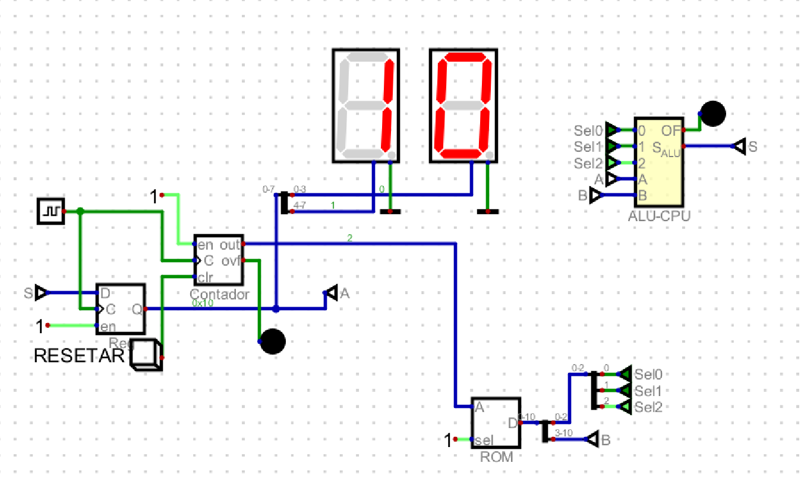

# Ponderada CPU
&emsp; Este repositório contém a execução e demonstração da ponderada da semana 7, construção de uma CPU(Unidade Central de Processamento)

## Vídeo demonstrativo
A seguir está um vídeo demontrativo do projeto desenvolvido 

[Vídeo Explicativo](https://youtu.be/EPHcQLzXJ3U)

&emsp; Os arquivos com a execução de cada um dos componentes da ALU, como somador, subtrator, multiplicador e operações como XOR, OR e AND se encontram na pasta arquivos.